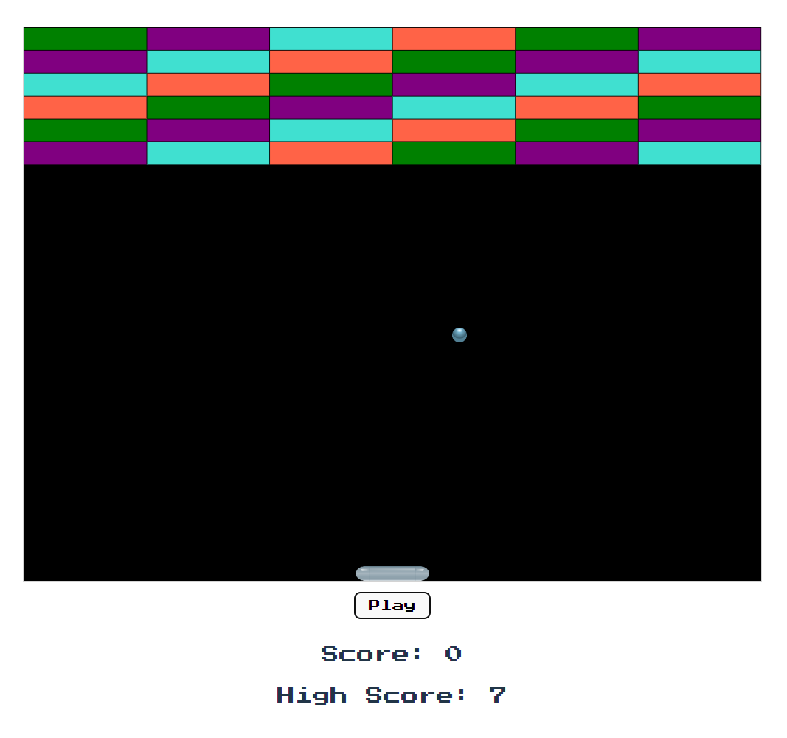

# Brick Breaker App



## Table of Contents
- [Introduction](#introduction)
- [Features](#features)
- [Getting Started](#getting-started)
  - [Prerequisites](#prerequisites)
  - [Installation](#installation)
- [Usage](#usage)

## Introduction
The Brick Breaker App is a classic game where you control a paddle to bounce a ball and break bricks. It's built using React and Vite, providing a fun and nostalgic gaming experience.

## Features
- Classic brick-breaking gameplay.
- Colorful and engaging graphics.
- High scores tracking.

## Getting Started

### Prerequisites
Make sure you have Node.js and npm (Node Package Manager) installed on your system. You can download them from [nodejs.org](https://nodejs.org/).

### Installation
1. Clone the repository:
   ```bash
   git clone https://github.com/yourusername/brick-breaker-app.git
   
2. Navigate to the project directory:
   ```bash
   cd brick-breaker-app

3. Install the dependencies using npm:
   ```bash
   npm install

## Usage
1. Start the development server:
   ```bash
   npm run dev

2. Open your web browser and visit  http://localhost:5173/ to play the game locally or you can access the web version at https://tlee-brick-breaker.netlify.app/

  
